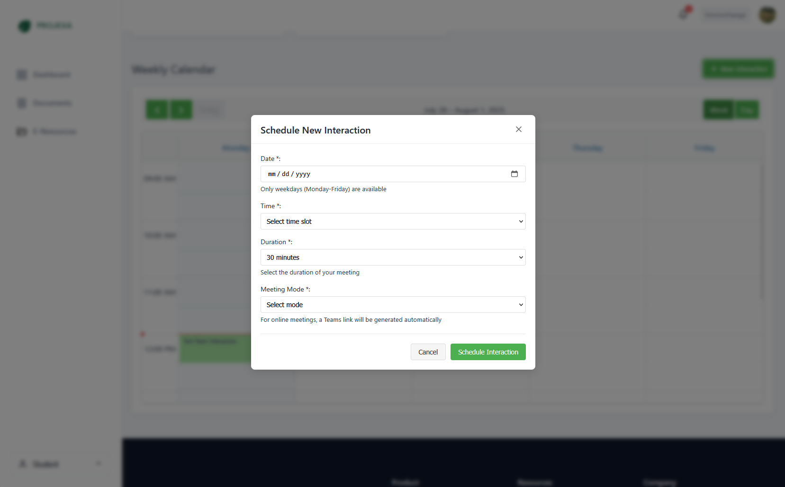
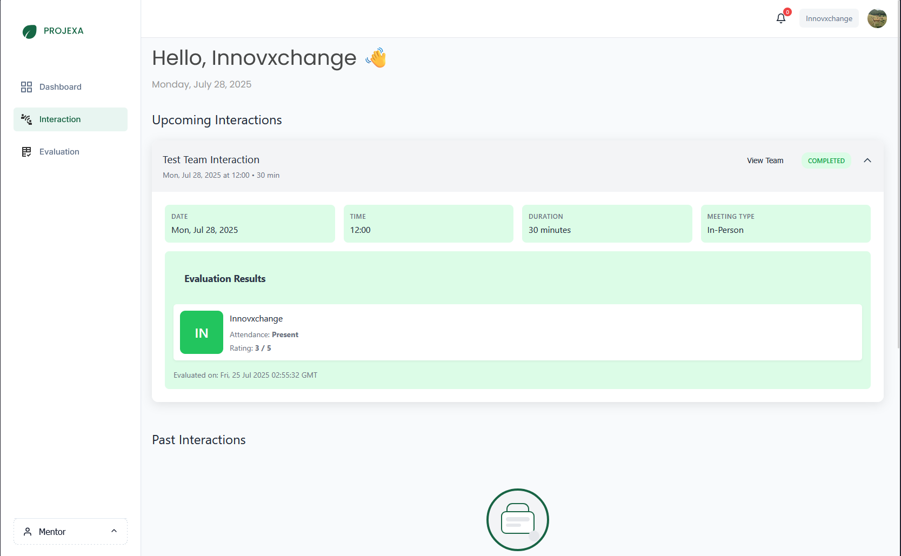

# Team Interaction

This section details how teams communicate and collaborate within the Projexa LMS.

## Team Communication and Collaboration

Projexa provides integrated features to facilitate communication and collaboration among team members and with assigned mentors.

### Mentor Assignment

Teams are typically assigned mentors (internal or external) who provide guidance, feedback, and support throughout the project lifecycle.

### Scheduling Mentor Interactions

Team leaders can schedule formal interaction sessions with their assigned mentors by going to their mentor's page. These interactions are crucial for progress updates, problem-solving, and receiving expert advice.

### Automated Interaction Management

The system automates several aspects of mentor interactions to ensure efficiency and accountability.

*   **Reminders:** Automated reminders are sent to both teams and mentors for upcoming scheduled interactions.
*   **Auto-Cancellation:** If a mentor does not respond to an interaction request by the scheduled time, the system automatically cancels the interaction and notifies the team via email.

### Interaction Ratings and Feedback

After each interaction, mentors are prompted to provide a rating and feedback for the team's performance. This feedback is a key component of the team's overall evaluation.

## Role-Based Access to Interaction Features

Access to team interaction functionalities is determined by user roles:

*   **Students:** Can view their team details, schedule interactions with their mentor (if they are the team leader), and view past interaction history.
*   **Mentors:** Can view their assigned teams, respond to interaction requests, and provide ratings and feedback for completed interactions.
*   **Coordinators:** Can view all teams and their interactions, assign mentors to teams, and monitor the overall interaction process.
*   **Admins:** Have full control over all team and interaction settings, including configuring team size limits and enabling cross-section teams.